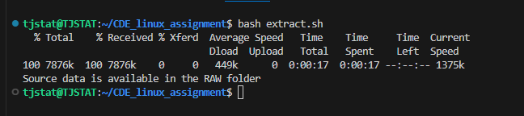
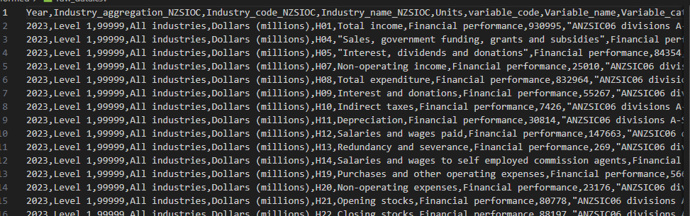
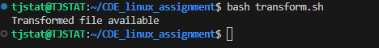
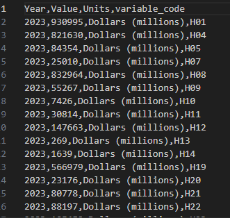

# practicing_simple_ETL_with_bash
Learning the linux OS for the first time, This project is to test and practice what I learnt, and showing how to perform simple ETL with bash scripting

## introduction: 
This project contains a bash script designed to execute a basic ETL pipeline for CoreDataEngineers' data infrastructure. The script performs the following: Extracts a CSV dataset, Transforms it by renaming a column and selecting specific fields, and Loads the resulting data into a final 'Gold' directory, confirming file integrity at each stage.

## Extract Task
_Download a CSV file. You can access the CSV using this link. Save it into a folder called raw. Your script should confirm that the file has been saved in the raw folder._

This is my script provided for the Extract task 
[Extract script](script_folder/extract.sh)

The results after running the bash script above:

_The raw data was successfully extracted in the RAW folder_

## Transform: Task
_After downloading the file, perform a simple transformation by renaming the column named Variable_code to variable_code. Then, select only the following columns: year, Value, Units, variable_code. Save the content of these selected columns into a file named 2023_year_finance.csv. This file should be saved in a folder called Transformed, your Bash script should confirm that it was loaded into the folder._

The Transform script :  
[Transform script](script_folder/transform.sh)

The results after running the bash script above:

_The raw data was successfully transformed and saved with 2023_year_finance in the TRANSFORM folder_

## Load:
_Load the transformed data into a directory named Gold. Also, confirm that the file has been saved in the folder._

The load script: 
[Load script](script_folder/load.sh)

The results after running the bash script above:

_The raw data was successfully loaded into the GOLD folder_

